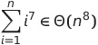

# Landau Symbole

This is a template page

## Excercises

### Zeige das ein Funktion in Θ(f) ist

**Vorgehen:** Um zu zeigen, dass eine Funktion f in Θ(g) ist muss man zeigen
1. das **f ∈ Ο(g)** ist
2. das **f ∈ Ω(g)** ist

<a href="./solutions/s1.pdf" target="_blank">Ex 1</a>  

<a href="./solutions/s1.pdf" target="_blank">Ex 2</a>  

