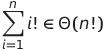
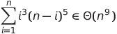
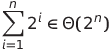

# Landau Symbole

This is a template page

## Excercises

### Zeige das ein Funktion in Θ(f) ist

**Vorgehen:** Um zu zeigen, dass eine Funktion **f ∈ Θ(g)** ist muss man zeigen
1. das **f ∈ Ο(g)** ist
2. das **f ∈ Ω(g)** ist

**Tips**: 
Bei Summen kann es oft hilfreich sein für die **f ∈ Ω(g)** Abschätzung ein Teilbereich der Summe sich anzuschauen

<!-- 
Formulas generated with
https://www.sciweavers.org/free-online-latex-equation-editor
Example formula
\sum_{i=1}^n i^7 \in \Theta(n^8)
 -->

<a href="./solutions/s1.png" target="_blank">Ex 1</a>  

<a href="./solutions/s2.png" target="_blank">Ex 2</a>  

<a href="./solutions/s3.png" target="_blank">Ex 3</a>  

<a href="./solutions/s4.png" target="_blank">Ex 4</a>  

<a href="./solutions/s5.png" target="_blank">Ex 5</a>  

<a href="./solutions/s6.png" target="_blank">Ex 6</a>  

 